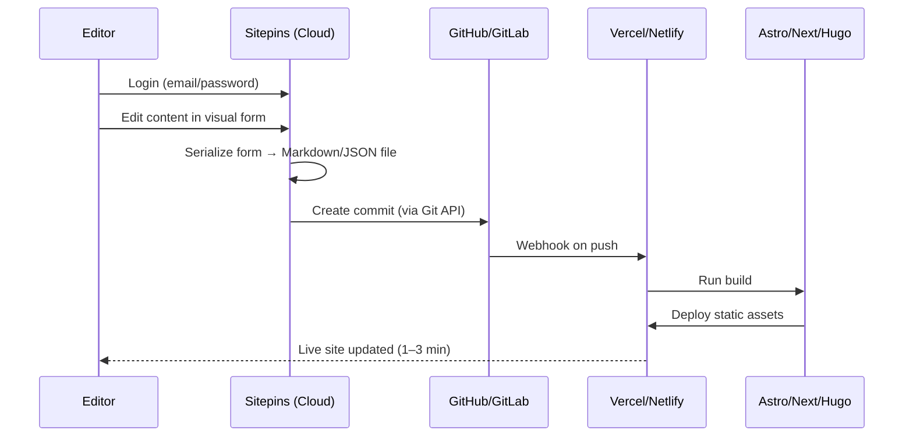

# Sitepins Clone — Analysis & Implementation Plan

> **Project:** `sitepins-clone`  
> **Goal:** Build a self-hosted (or SaaS-ready) Git-based headless CMS that matches Sitepins’ ease of use, developer workflow, and editor experience.  
> **Sources analyzed:** [Sitepins Docs](https://docs.sitepins.com), [Marketing Site](https://sitepins.com), [Pricing](https://sitepins.com/pricing), [Jamstack listing](https://jamstack.org/headless-cms/sitepins/), [Astro integration guide](https://docs.astro.build/en/guides/cms/sitepins/), and Sitepins blog posts (May 2026 updates, Astro visual editor guide).

---

## Table of Contents

1. [Executive Summary](#1-executive-summary)
2. [What Sitepins Is (and Why It Works)](#2-what-sitepins-is-and-why-it-works)
3. [Complete Feature Inventory](#3-complete-feature-inventory)
4. [How Sitepins Works — Technical Architecture](#4-how-sitepins-works--technical-architecture)
5. [User Journeys We Must Replicate](#5-user-journeys-we-must-replicate)
6. [What We Are Building](#6-what-we-are-building)
7. [How We Will Build It](#7-how-we-will-build-it)
8. [System Architecture (Our Clone)](#8-system-architecture-our-clone)
9. [Data Models & Config Format](#9-data-models--config-format)
10. [Implementation Phases](#10-implementation-phases)
11. [Tech Stack Recommendation](#11-tech-stack-recommendation)
12. [Parity Checklist](#12-parity-checklist)
13. [Risks, Trade-offs & Differentiators](#13-risks-trade-offs--differentiators)
14. [References](#14-references)
15. [Hybrid Approach: Sitepins Ease + Keystatic Pages/Sections](#15-hybrid-approach-sitepins-ease--keystatic-pagessections)

---

## 1. Executive Summary

**Sitepins** is a cloud-hosted, Git-based headless CMS for static site generators (Astro, Next.js, Hugo, Eleventy, Jekyll, Nuxt, SvelteKit). It does **not** host or render sites. It connects to a Git repository, reads existing content files (Markdown, JSON, YAML, TOML), and overlays a visual editing UI. Every save becomes a Git commit.

**Why Sitepins feels “really good”:**

| Principle | What it means for users |
|-----------|-------------------------|
| **Zero install on the site** | No npm packages, no `astro.config` changes — connect repo and go |
| **Zero schema authoring** | Forms are inferred from existing frontmatter / file structure |
| **Git is invisible to editors** | Non-technical users never see branches, YAML, or file trees |
| **Content stays in the repo** | No vendor lock-in; stop using the CMS and files remain |
| **Framework-aware setup** | Suggests `src/content`, `public/images`, etc. per SSG |
| **Save = publish** | Commit to `main` → Vercel/Netlify rebuilds automatically |

**Our clone** should reproduce this **abstraction layer** over Git: fast onboarding, automatic schema detection, visual + Markdown editing, media library, team roles, live preview, and optional AI — while keeping content as plain files in the customer’s repository.

**Scope decision (current):** **Pure Sitepins approach only** — no schema files, no code changes in the customer’s site repo, no Keystatic-style page/section builder for now. Connect repo → pick folders → auto-detect fields from existing files → edit → Git commit. Section 15 is deferred.

---

## 2. What Sitepins Is (and Why It Works)

### 2.1 Product positioning

- **For developers:** Git-native workflow, no database, works with any SSG, reversible commits.
- **For editors/clients:** Word-processor-like UI, no GitHub account required, no Markdown required.
- **For agencies:** Hand off Astro/Next/Hugo sites in ~10–15 minutes.

### 2.2 Core philosophy (from docs)

> Sitepins doesn’t host or render your site. It reads your existing content files and overlays a visual editor.

This is the single most important design constraint for our clone:

1. **Read** files from Git  
2. **Edit** through generated UI  
3. **Write** back as the same file formats  
4. **Commit** via Git provider API  

### 2.3 What Sitepins is NOT

- Not a page builder or drag-and-drop layout tool  
- Not a site host or CDN  
- Not a proprietary content database  
- Not a replacement for the SSG build pipeline  

### 2.4 Competitive context

| Tool | Similarity | Gap vs Sitepins |
|------|------------|-----------------|
| **Decap CMS** | Git-based, open source | Manual YAML config; form-heavy, less polished |
| **TinaCMS** | Visual editing | React-centric; more dev setup |
| **CloudCannon** | Visual + Git | Higher cost; more proprietary |
| **Keystatic** | Git-based, local-first | Requires more project integration |

**Sitepins’ edge:** maximum abstraction — connect repo → pick folders → edit. Our clone should optimize for the same **time-to-first-edit** metric.

---

## 3. Complete Feature Inventory

Features grouped by area, with plan tier hints from [pricing](https://sitepins.com/pricing).

### 3.1 Onboarding & configuration

| Feature | Description | Tier |
|---------|-------------|------|
| No-code setup | Register → connect Git → configure folders | Free |
| GitHub OAuth | Connect repositories via OAuth app | Free (GitHub only) |
| GitLab support | Connect GitLab repos | Team+ |
| Framework detection | Auto-detect Astro / Next.js / Hugo | All |
| Content folder picker | Select parent dir for `.md`, `.mdx`, `.json`, etc. | All |
| Media root + media public | Separate storage path vs public URL path | All |
| Code folder (optional) | Layouts/components path | All |
| Site configs (optional) | `config.json`, `menu.json`, theme files | All |
| `.sitepins/config.json` | Persisted config committed to repo | All |
| Custom commit messages | Dialog before each commit | Pro+ |
| Auto commit messages | Generated on save | All |
| Target branch | `main` vs `staging` for review workflows | Pro+ |
| Multiple content sections | Multiple folders as sidebar groups (Blog, Docs) | All |

### 3.2 Content editing

| Feature | Description | Tier |
|---------|-------------|------|
| Content list view | Titles, dates, draft status, filter/sort | All |
| Auto schema detection | Infer fields from frontmatter in existing files | All |
| Field type mapping | `title` → text, `date` → date picker, `tags` → tag widget, `draft` → toggle | All |
| Visual rich text editor | Bold, italic, H1–H4, lists, links, blockquote, code | All |
| Raw Markdown mode | Synced with visual mode | All |
| New entry creation | Generate filename from title, create `.md` in collection | All |
| Nested collections | Folder hierarchy in sidebar | All |
| Shortcodes / custom blocks | Modular reusable content blocks in body | Pro+ |
| Raw code edit | Edit file source directly | Pro+ |
| Code snippet support | Syntax-highlighted snippets in content | Pro+ |
| Config file editing | JSON/YAML/TOML via forms or raw | All |
| Concurrent edit handling | Lock / live presence when two users open same file | All |
| Collaborative editing | Live cursors + name labels (Google Docs style) | Recent |
| Rollback previous version | Revert to prior Git commit for an entry | Pro+ |
| Sidebar arrangement | Customize collection order in UI | Pro+ |
| Global search | `Cmd/Ctrl + K` + visible search UI | All |
| Activity log | Who changed what | All |
| Recent file changes | Renames, updates, non-content edits | All |

### 3.3 Media

| Feature | Description | Tier |
|---------|-------------|------|
| Drag-and-drop upload | Files committed to media root in Git | All |
| Folder organization | Create `blog/`, `team/` subfolders | All |
| Grid / list views | Toggle layout | All |
| Search & sort | By name, date | All |
| Preview + metadata | Click file for details | All |
| Delete from repo | Removes file from Git | All |
| Auto path insertion | Upload → insert correct path in frontmatter/body | All |

### 3.4 Preview & deploy awareness

| Feature | Description | Tier |
|---------|-------------|------|
| Live preview sandbox | Real-time page preview as you edit | Pro+ |
| Deployment status | Build/deploy indicators (Vercel, Netlify, etc.) | Pro+ |
| PR workflow | Open PR from staging → main from CMS | Pro+ |

### 3.5 Team & access

| Feature | Description | Tier |
|---------|-------------|------|
| Organizations | Multi-tenant workspace | All |
| Email invite | Editors don’t need GitHub accounts | All |
| Role-based access | Custom roles (edit, commit, publish, settings) | Pro+ |
| Live presence avatars | Who is online / editing | All |

### 3.6 AI & SEO

| Feature | Description | Tier |
|---------|-------------|------|
| AI assistant | BYOK: OpenAI, Gemini, Claude, Grok | Pro+ |
| SEO suggestions | Content SEO hints | Pro+ |

### 3.7 Platform

| Feature | Description | Tier |
|---------|-------------|------|
| Dark mode | UI theme | All |
| i18n (12 languages) | Native UI localization | All |
| Multi-format support | MD, MDX, JSON, YAML, TOML | All |
| SSG support | Astro, Next, Hugo, 11ty, Jekyll, Nuxt, SvelteKit | All |

---

## 4. How Sitepins Works — Technical Architecture

### 4.1 High-level flow



### 4.2 Repository integration

1. **OAuth app** on GitHub (GitLab on higher tiers) — scoped to repo read/write.
2. **Initial scan:** List directory tree; user picks content/media/config folders.
3. **Config persistence:** Writes `.sitepins/config.json` (or equivalent) into the repo.
4. **Ongoing sync:** CMS reads file contents via Git API; writes via commit API (single-file or multi-file commits).

### 4.3 Schema detection (zero-config magic)

Sitepins does **not** require a separate CMS schema file. It:

1. Scans content files in the selected folder(s).
2. Parses frontmatter (YAML/TOML) or JSON structure.
3. Builds a **union of fields** seen across entries.
4. Infers widget types from value shapes:

| Value pattern | Inferred field type |
|---------------|---------------------|
| ISO date string | Date picker |
| Boolean | Toggle |
| String array | Tags / multi-select |
| Image path (`/images/...`) | Media picker |
| Long string | Textarea |
| Short string | Text input |
| Nested object/array | Repeatable blocks / shortcodes |

> Note: Zod schemas in `src/content/config.ts` are **not** read directly — inference is from file content. Optional manual field overrides in project settings refine mapping.

### 4.4 File formats

| Format | Use case |
|--------|----------|
| `.md` / `.mdx` | Blog posts, pages with frontmatter + body |
| `.json` | Config, data files (Hugo `data/`, Astro config) |
| `.yaml` / `.yml` | Hugo config, frontmatter |
| `.toml` | Hugo config, frontmatter |

### 4.5 Media path resolution

Two settings work together:

- **Media Root** (`public/images/blog`) — where CMS uploads land in the repo.
- **Media Public** (`public`) — prefix stripped when generating URLs for the SSG.

Example: file at `public/images/blog/hero.jpg` → site URL `/images/blog/hero.jpg`.

### 4.6 Git commit strategy

- Default message: `Update: "Post title"` (auto-generated).
- Optional custom message (Pro).
- Commits go to configured branch (`main` or `staging`).
- Multi-file commits when saving content + uploaded image together.

### 4.7 Live preview (Pro)

Likely architecture (inferred from product behavior):

1. CMS holds draft state in memory (or ephemeral branch).
2. Preview iframe loads a **sandbox build** or **dev server proxy** fed by draft content.
3. Debounced updates push changes to preview without full Git commit (preview) vs commit on Save (publish).

Our clone should support at minimum: **iframe preview** pointing at a staging URL or local preview service.

### 4.8 Authentication model

| Actor | Auth |
|-------|------|
| Developer (project owner) | Sitepins account + Git OAuth |
| Editor (invited) | Sitepins email/password only |
| Git provider | CMS service account / OAuth token on behalf of org |

Editors never receive Git credentials.

---

## 5. User Journeys We Must Replicate

### 5.1 Developer: first-time setup (target: 10–15 min)

1. Create account / organization.
2. **New Project** → authorize GitHub.
3. Select repository.
4. **Configure site** (4 steps):
   - Content folder (e.g. `src/content`)
   - Media root + media public
   - Code folder (optional)
   - Site configs (optional)
5. Toggle commit message preference.
6. **Finish Setup** → `.sitepins/config.json` committed.
7. Invite editor by email with **Editor** role.

### 5.2 Editor: daily workflow (target: zero training)

1. Log in → see sidebar sections (Blog, Docs, …).
2. Open collection → list of entries with status.
3. Click entry → form (frontmatter) + rich text body.
4. Upload image via toolbar or image field → auto path.
5. **Save** → success toast (“site is updating”).
6. Optionally switch to Markdown mode.
7. **New Entry** → fill form → save → new `.md` file in repo.

### 5.3 Review workflow (Pro)

1. Developer sets target branch to `staging`.
2. Editor saves to staging (no production deploy).
3. Editor or developer opens PR `staging → main` from CMS.
4. Merge → production deploy.

### 5.4 Media management

1. Open Media Library.
2. Drag image → appears in grid → committed to `mediaRoot`.
3. Insert into content field with correct public path.

---

## 6. What We Are Building

### 6.1 Product name (working)

**Working title:** `sitepins-clone` (rename later, e.g. **PinCMS**, **GitPin**, **StaticEdit**).

### 6.2 MVP scope (Phase 1 — “feels like Sitepins”)

Must ship:

- [ ] Auth (email + password, orgs)
- [ ] GitHub OAuth + repo picker
- [ ] 4-step site configuration wizard
- [ ] `.sitepins/config.json` generation
- [ ] Framework-aware folder suggestions (Astro, Next, Hugo)
- [ ] Content tree scan + collection sidebar
- [ ] Auto schema detection from frontmatter
- [ ] Visual editor + Markdown mode (synced)
- [ ] Create / update / delete content entries
- [ ] Git commit on save (auto messages)
- [ ] Media library (upload, folders, delete, insert path)
- [ ] Entry list with draft/status columns
- [ ] Basic roles: Owner, Editor
- [ ] Dark mode

### 6.3 Full parity scope (Phase 2–4)

- Live preview sandbox  
- AI assistant (BYOK)  
- Custom commit messages  
- Branch targeting + PR creation  
- Rollback / version history UI  
- Shortcodes & nested blocks  
- Collaborative editing (presence + cursors)  
- GitLab support  
- Deployment status webhooks  
- i18n (12 languages)  
- SEO suggestions  

### 6.4 Deployment models

| Model | Description |
|-------|-------------|
| **SaaS** (like Sitepins) | Multi-tenant cloud at `app.ourcms.com` |
| **Self-hosted** | Docker compose for agencies |
| **Hybrid** | Core OSS + hosted Pro features |

Recommend building **SaaS-first architecture** with self-hosted option later.

---

## 7. How We Will Build It

### 7.1 Design principles (copy Sitepins’ “easy”)

1. **Convention over configuration** — detect framework from `package.json`, `astro.config.mjs`, `hugo.toml`, etc.
2. **Never show the repo raw** to editors — only collections and entries.
3. **Optimistic UI** — save feels instant; Git commit async with retry.
4. **Fail gracefully** — if frontmatter is invalid, show raw editor with clear error.
5. **Same files in, same files out** — round-trip Markdown without reformating surprises.

### 7.2 Core services

```
┌─────────────────────────────────────────────────────────────┐
│                        Web App (SPA)                        │
│  Dashboard │ Editor │ Media │ Settings │ Team │ Preview    │
└──────────────────────────┬──────────────────────────────────┘
                           │
┌──────────────────────────▼──────────────────────────────────┐
│                      API Server                              │
│  Auth │ Projects │ Content │ Media │ Git │ Schema │ Search  │
└──────┬──────────────┬──────────────┬──────────────┬─────────┘
       │              │              │              │
   PostgreSQL      Redis          GitHub API     Preview Worker
   (users,         (cache,        GitLab API     (optional SSR
    projects,       locks,         (commits,       sandbox)
    audit)          sessions)      tree, blobs)
```

### 7.3 Git integration layer

Abstract provider behind one interface:

```typescript
interface GitProvider {
  listRepos(): Promise<Repo[]>;
  getTree(repo, branch, path): Promise<TreeEntry[]>;
  getFile(repo, branch, path): Promise<string>;
  commitFiles(repo, branch, message, files[]): Promise<CommitSha>;
  createBranch(repo, from, name): Promise<void>;
  createPullRequest(repo, head, base, title): Promise<PrUrl>;
}
```

Use GitHub App (preferred for orgs) or OAuth App for MVP.

### 7.4 Content parsing pipeline

```
Raw file bytes
    → detect format (md/mdx/json/yaml/toml)
    → parse frontmatter (gray-matter / toml / yaml)
    → extract body (Markdown/MDX)
    → merge into ContentDocument { fields, body, path, sha }
```

On save:

```
ContentDocument
    → validate required fields
    → serialize frontmatter + body
    → preserve unrelated frontmatter keys (critical!)
    → commit via Git API
```

### 7.5 Schema inference engine

```typescript
interface FieldSchema {
  name: string;
  type: 'string' | 'text' | 'number' | 'boolean' | 'date' | 'datetime'
       | 'image' | 'file' | 'tags' | 'select' | 'object' | 'array' | 'blocks';
  required?: boolean;
  label?: string;
  options?: string[];  // for select
  fields?: FieldSchema[];  // for object/array
}
```

Algorithm:

1. Sample N files per collection (or all if < 50).
2. For each key in frontmatter, track types seen.
3. Resolve conflicts (string + number → string with coercion).
4. Allow manual overrides stored in project settings DB (not necessarily in repo).

### 7.6 Editor stack

| Layer | Recommendation |
|-------|----------------|
| Rich text | TipTap or Plate (Markdown round-trip) |
| Markdown sync | Unified AST so visual ↔ raw stays consistent |
| MDX | `@mdx-js/mdx` parse for body; careful with components |
| JSON/YAML forms | `react-jsonschema-form` or custom field renderer |

### 7.7 Media handling

1. Upload to API → binary stored temporarily.
2. Compute path: `{mediaRoot}/{folder}/{slugified-filename}`.
3. Single commit: content file + binary (GitHub contents API base64).
4. Return public URL using `mediaPublic` mapping.

**Large files:** For > 1MB, consider Git LFS or external blob store in Phase 3.

### 7.8 Concurrency

| Strategy | When |
|----------|------|
| Optimistic lock (ETag / Git SHA) | On save — reject if `sha` changed |
| Soft lock (Redis, 5 min TTL) | When user opens entry |
| Live presence (WebSocket) | Phase 3 — show avatars/cursors |

---

## 8. System Architecture (Our Clone)

### 8.1 Monorepo layout (proposed)

```
sitepins-clone/
├── apps/
│   ├── web/                 # Next.js or Astro — CMS dashboard
│   └── api/                 # Node.js / Hono / Nest — REST + WebSocket
├── packages/
│   ├── git-client/          # GitHub/GitLab abstraction
│   ├── content-parser/      # MD/JSON/YAML/TOML parse & serialize
│   ├── schema-inference/    # Auto field detection
│   ├── ui/                  # Shared editor components
│   └── types/               # Shared TypeScript types
├── docker/
│   └── docker-compose.yml   # Postgres, Redis, API, Web
└── docs/
    └── SITEPINS-CLONE-PLAN.md
```

### 8.2 Database schema (minimal)

| Table | Purpose |
|-------|---------|
| `users` | Email, password hash, name |
| `organizations` | Name, slug |
| `memberships` | user_id, org_id, role |
| `projects` | org_id, name, git_repo, git_provider, default_branch |
| `project_config` | content_roots[], media_root, media_public, code_root, config_paths[] |
| `field_overrides` | project_id, collection, field_name, forced_type |
| `git_connections` | encrypted OAuth tokens / GitHub App installation id |
| `invitations` | email, project_id, role, token |
| `activity_log` | project_id, user_id, action, entity_path, commit_sha |

> Content itself lives in **Git only** — not in our database. DB holds metadata, settings, and tokens.

### 8.3 Framework detection heuristics

| Signal | Framework |
|--------|-----------|
| `astro.config.mjs` | Astro |
| `next.config.js` + `src/content/` | Next.js |
| `hugo.toml` / `config.toml` | Hugo |
| `eleventy.config.js` | Eleventy |
| `_config.yml` (Jekyll) | Jekyll |
| `nuxt.config.ts` | Nuxt |
| `svelte.config.js` + `src/routes` | SvelteKit |

Suggest default paths per framework (from Sitepins docs):

| Framework | Content | Media Root | Media Public | Code | Config |
|-----------|---------|------------|--------------|------|--------|
| Astro / Next | `src/content` | `public/images` | `public` | `src/layouts` | `src/config` |
| Hugo | `content` | `assets/images` or `static/images` | `assets` or `static` | `themes/layouts` | `config`, `data` |

---

## 9. Data Models & Config Format

### 9.1 `.sitepins/config.json` (committed to customer repo)

Aligned with [Configure Site](https://docs.sitepins.com/docs/guides/configure-site):

```json
{
  "version": 1,
  "framework": "astro",
  "content": {
    "roots": [
      { "id": "blog", "label": "Blog", "path": "src/content/blog" },
      { "id": "docs", "label": "Docs", "path": "src/content/docs" }
    ]
  },
  "media": {
    "root": "public/images",
    "publicPath": "public"
  },
  "code": {
    "root": "src/layouts"
  },
  "configs": [
    "src/config/config.json",
    "src/config/menu.json"
  ],
  "git": {
    "defaultBranch": "main",
    "commitMessageMode": "auto"
  }
}
```

### 9.2 Content document (internal API model)

```typescript
interface ContentEntry {
  id: string;              // stable id = file path
  path: string;            // e.g. src/content/blog/hello-world.md
  sha: string;             // Git blob SHA for optimistic locking
  collection: string;      // blog
  frontmatter: Record<string, unknown>;
  body: string;            // Markdown body
  format: 'md' | 'mdx' | 'json' | 'yaml' | 'toml';
  draft?: boolean;
  updatedAt: string;
}
```

---

## 10. Implementation Phases

### Phase 0 — Foundation (Week 1–2)

| Task | Output |
|------|--------|
| Monorepo scaffold | Turborepo + pnpm |
| Postgres + Prisma schema | Users, orgs, projects |
| Email auth | Register, login, JWT sessions |
| Basic dashboard shell | Sidebar, dark mode, routing |

### Phase 1 — Git connect & configure (Week 3–4)

| Task | Output |
|------|--------|
| GitHub OAuth | Token storage, repo list |
| Repo tree browser | Folder picker UI |
| Configuration wizard | 4-step flow matching Sitepins |
| Write `.sitepins/config.json` | First commit from CMS |
| Framework detection | Auto-suggest paths |

**Milestone:** Developer connects Astro repo and sees folder structure saved.

### Phase 2 — Content CRUD (Week 5–7)

| Task | Output |
|------|--------|
| Content scanner | Map folders → collections → entries |
| Schema inference | Auto forms from frontmatter |
| Entry list page | Sort, filter by draft |
| Visual + Markdown editor | TipTap + synced raw mode |
| Save → Git commit | Auto commit messages |
| New entry / delete entry | File create/delete in repo |
| Edit JSON/YAML config files | Basic form view |

**Milestone:** Editor can update a blog post without touching GitHub.

### Phase 3 — Media & team (Week 8–9)

| Task | Output |
|------|--------|
| Media library UI | Grid/list, upload, delete |
| Path insertion | Media picker in fields & editor |
| Email invites | Editor role without GitHub |
| RBAC | Owner vs Editor permissions |
| Activity log | Audit trail |
| Concurrent edit lock | SHA-based conflict detection |

**Milestone:** Full handoff workflow works for a real Astro site.

### Phase 4 — Pro features (Week 10–14)

| Task | Output |
|------|--------|
| Custom commit messages | Modal on save |
| Branch targeting | Save to `staging` |
| PR creation | staging → main |
| Version history / rollback | List commits per file, restore |
| Live preview iframe | Staging URL or preview worker |
| Global search | Cmd+K across entries + media |
| AI assistant (BYOK) | OpenAI first, then multi-provider |

**Milestone:** Feature parity with Sitepins Pro tier for core editing.

### Phase 5 — Polish & scale (Week 15+)

| Task | Output |
|------|--------|
| i18n (12 locales) | UI translations |
| GitLab provider | Second Git host |
| Collaborative cursors | WebSocket presence |
| Shortcode/block editor | Custom MDX components |
| Deployment status | Vercel/Netlify webhook integration |
| SEO suggestions | Basic analysis on save |

---

## 11. Tech Stack Recommendation

| Layer | Choice | Rationale |
|-------|--------|-----------|
| **Frontend** | Next.js 15 (App Router) + React | Matches ecosystem; good for dashboard SPA |
| **UI** | shadcn/ui + Tailwind CSS | Fast, polished, dark mode |
| **Editor** | TipTap + `@tiptap/extension-markdown` | Sitepins-quality rich text |
| **API** | Hono or NestJS on Node | Git operations, webhooks, WS |
| **DB** | PostgreSQL + Prisma | Relational, mature |
| **Cache / locks** | Redis | Sessions, edit locks, rate limits |
| **Auth** | Lucia or NextAuth v5 | Email + OAuth |
| **Git** | Octokit (`@octokit/rest`) | GitHub API |
| **Parsing** | `gray-matter`, `yaml`, `smol-toml` | Frontmatter |
| **Monorepo** | Turborepo + pnpm | Shared packages |
| **Deploy** | Vercel (web) + Railway/Fly (API) | Simple ops |

---

## 12. Parity Checklist

Use this to track clone completeness against Sitepins.

### Onboarding
- [ ] Register / login without credit card
- [ ] Create organization
- [ ] Connect GitHub repository
- [ ] Pick content folder from tree dropdown
- [ ] Configure media root + media public with auto-parent suggestion
- [ ] Optional code + config folders
- [ ] Commit `.sitepins/config.json`
- [ ] Finish setup → content sidebar appears

### Editing
- [ ] Collection list with title, date, draft
- [ ] Auto-detected frontmatter form
- [ ] Visual editor toolbar (bold, headings, lists, links, images, code)
- [ ] Markdown mode synced with visual
- [ ] Create new entry (filename from title)
- [ ] Delete entry
- [ ] Save commits to Git with readable message
- [ ] Handle MDX files without stripping components

### Media
- [ ] Drag-and-drop upload
- [ ] Create subfolders
- [ ] Grid and list view
- [ ] Search by filename
- [ ] Delete removes from repo
- [ ] Correct public URL in content

### Team
- [ ] Invite by email
- [ ] Editor role (no settings access)
- [ ] Owner role (full access)
- [ ] Activity log

### Advanced (Pro parity)
- [ ] Custom commit messages
- [ ] Branch selection
- [ ] Open pull request from UI
- [ ] Rollback to previous version
- [ ] Live preview sandbox
- [ ] AI content assist (BYOK)
- [ ] Deployment status indicator
- [ ] Global search (Cmd+K)
- [ ] 12-language UI
- [ ] Live collaborative cursors

---

## 13. Risks, Trade-offs & Differentiators

### 13.1 Risks

| Risk | Mitigation |
|------|------------|
| Git API rate limits | Cache tree; batch commits; GitHub App |
| Large repos slow to scan | Lazy-load collections; index on first connect |
| MDX round-trip breaks components | Preserve unknown AST nodes; raw fallback |
| Binary files bloat repo | Document best practices; LFS later |
| Multi-user edit conflicts | SHA locking + clear merge UI |

### 13.2 Intentional trade-offs (MVP)

- GitHub only at first (GitLab in Phase 5)  
- No on-page / contextual editing (Tina-style) — form-based like Sitepins  
- Preview via staging URL, not embedded SSG dev server initially  

### 13.3 Possible differentiators (beat Sitepins)

| Idea | Value |
|------|-------|
| **Fully open source** | Community, self-host, trust |
| **Tighter Zod schema import** | Read `content/config.ts` for precise forms |
| **Local offline mode** | Edit cached files, sync when online |
| **Built-in Astro starter** | One-click demo project |
| **No site limit on self-hosted** | Agency-friendly |

---

## 14. References

### Official Sitepins
- Getting started: https://docs.sitepins.com/docs/guides/getting-started  
- Configure site: https://docs.sitepins.com/docs/guides/configure-site  
- Media library: https://docs.sitepins.com/docs/guides/media-library  
- App: https://app.sitepins.com  
- Demo: https://demo.sitepins.com  
- Pricing: https://sitepins.com/pricing  
- Roadmap: https://updates.sitepins.com  

### Guides & articles
- Astro + Sitepins: https://docs.astro.build/en/guides/cms/sitepins/  
- Visual editor for Astro: https://sitepins.com/blog/visual-editor-for-astro-websites  
- Git-based CMS explainer: https://sitepins.com/blog/git-based-headless-cms  
- May 2026 product update: https://sitepins.com/blog/whats-new-in-sitepins-may-2026  
- Jamstack listing: https://jamstack.org/headless-cms/sitepins/  

### Comparable open-source projects to study
- Decap CMS: https://decapcms.org/  
- TinaCMS: https://tina.io/  
- Keystatic: https://keystatic.com/  
- Pages CMS: https://pagescms.org/  

---

## 15. Hybrid Approach: Sitepins Ease + Keystatic Pages/Sections

> **Status: DEFERRED — not in current scope.**  
> The user has decided to build a **pure Sitepins clone first**: zero schema, zero code-side setup in the site repo. This section is kept for future reference only.

This section defined how we *could* add **“New Page”** and **“Add Section”** (Keystatic-like) later. It is **not** part of the current build.

### 15.1 The problem with pure Sitepins vs pure Keystatic

| | Sitepins | Keystatic | What we want |
|---|----------|-----------|--------------|
| **Onboarding** | Connect repo → edit in minutes | Install npm package + write `keystatic.config.ts` | Sitepins speed |
| **New page** | Infers from existing files; limited page types | `collection` + slug + template | One-click new page |
| **Sections** | Shortcodes in MDX; inferred arrays | `blocks` field + content components | Pick section → fill form → reorder |
| **Schema** | Auto-detect from frontmatter | Developer defines in code | Auto-detect first, refine later |
| **Editor UX** | Non-technical friendly | Developer-first | Non-technical friendly |

**Our approach: Progressive Schema** — start with Sitepins-style inference, unlock Keystatic-style page builders when the project needs them.

### 15.2 Core concept: three content primitives

Map Keystatic concepts to user-friendly names in our CMS:

| Keystatic | Our CMS label | Purpose | Example |
|-----------|---------------|---------|---------|
| `collection` | **Page Type** (multi) | Many entries of same shape | Marketing pages, blog posts, team members |
| `singleton` | **Single Page** | One-off page | Homepage, Settings, Contact |
| `blocks` / content components | **Section** | Reorderable page building blocks | Hero, FAQ, Features, CTA |

Editors never see these terms. They see:

- **“New Page”** → pick type (About Page, Landing Page, Blog Post) → enter title → save
- **“Add Section”** → pick from list (Hero, Testimonials, Pricing) → fill fields → drag to reorder

### 15.3 Recommended architecture: two-layer content model

```
┌─────────────────────────────────────────────────────────────┐
│  Layer 1 — AUTO (Sitepins-style)          Always on         │
│  Scan repo → infer collections → infer fields → edit forms   │
└──────────────────────────┬──────────────────────────────────┘
                           │ upgrades when needed
┌──────────────────────────▼──────────────────────────────────┐
│  Layer 2 — SCHEMA (Keystatic-style)       Optional          │
│  .sitepins/schema.json → page types → section definitions  │
└─────────────────────────────────────────────────────────────┘
```

**Layer 1** works on day one with zero schema file (existing Sitepins plan).

**Layer 2** is added when developers or power users want controlled page building. Stored in the repo at `.sitepins/schema.json` (committed via CMS, like `config.json`).

### 15.4 How “New Page” works

#### Path A — No schema file (auto mode)

1. User clicks **New Page** in a sidebar collection (e.g. “Pages”).
2. CMS clones the **nearest template entry** in that folder (same frontmatter keys, empty body/sections).
3. User enters **title** → CMS generates slug + filename (`about-us.md`, `src/content/pages/about-us.md`).
4. Form opens with inferred fields; user edits and saves → Git commit.

Same as Sitepins “New Entry”, but surfaced as **“New Page”** for page-shaped collections.

#### Path B — With schema (structured mode)

Schema defines page types explicitly:

```json
{
  "pageTypes": [
    {
      "id": "marketing-page",
      "label": "Marketing Page",
      "kind": "collection",
      "path": "src/content/pages/{slug}.md",
      "slugField": "title",
      "fields": [
        { "name": "title", "type": "string", "required": true },
        { "name": "description", "type": "text" },
        { "name": "sections", "type": "blocks", "sectionTypes": ["hero", "features", "faq", "cta"] }
      ],
      "template": "src/content/pages/_template.md"
    },
    {
      "id": "homepage",
      "label": "Homepage",
      "kind": "singleton",
      "path": "src/content/pages/home.md",
      "fields": [
        { "name": "sections", "type": "blocks", "sectionTypes": ["hero", "logos", "testimonials", "cta"] }
      ]
    }
  ]
}
```

**New Page flow:**

1. **New Page** → dropdown of `pageTypes` where `kind: "collection"`.
2. Title + slug (auto-generated, editable).
3. CMS creates file at `path` with template frontmatter + empty `sections: []`.
4. Editor opens page builder (sections UI).

### 15.5 How “Add Section” works

Sections are a **`blocks` field** — an ordered array where each item has a `type` and type-specific fields.

#### Editor UX (must feel easy)

```
┌──────────────────────────────────────────────────────────┐
│  About Us                                    [Save]       │
├──────────────────────────────────────────────────────────┤
│  Title: [ About Us          ]   Slug: [ about-us ]       │
│  Description: [ ... ]                                     │
├──────────────────────────────────────────────────────────┤
│  Sections                          [ + Add Section ▾ ]   │
│  ┌────────────────────────────────────────────────────┐  │
│  │ ≡  Hero          [Edit] [Duplicate] [Delete]      │  │
│  │    Headline: "We build..."                        │  │
│  └────────────────────────────────────────────────────┘  │
│  ┌────────────────────────────────────────────────────┐  │
│  │ ≡  Features      [Edit] [Duplicate] [Delete]      │  │
│  │    3 items                                        │  │
│  └────────────────────────────────────────────────────┘  │
│  ┌────────────────────────────────────────────────────┐  │
│  │ ≡  FAQ           [Edit] [Duplicate] [Delete]      │  │
│  └────────────────────────────────────────────────────┘  │
└──────────────────────────────────────────────────────────┘
```

- **≡** = drag handle for reorder
- **+ Add Section** = dropdown of allowed section types for this page type
- Click section → expand inline form (not a separate screen)
- **Duplicate** / **Delete** per section

#### Section type definition (in schema)

```json
{
  "sectionTypes": [
    {
      "id": "hero",
      "label": "Hero",
      "icon": "layout-hero",
      "fields": [
        { "name": "headline", "type": "string", "label": "Headline" },
        { "name": "subheadline", "type": "text", "label": "Subheadline" },
        { "name": "image", "type": "image", "label": "Background Image" },
        { "name": "cta", "type": "object", "fields": [
          { "name": "label", "type": "string" },
          { "name": "url", "type": "string" }
        ]}
      ]
    },
    {
      "id": "faq",
      "label": "FAQ",
      "fields": [
        { "name": "title", "type": "string" },
        { "name": "items", "type": "array", "fields": [
          { "name": "question", "type": "string" },
          { "name": "answer", "type": "text" }
        ]}
      ]
    }
  ]
}
```

#### How sections are stored in Git (pick one strategy per project)

| Strategy | Stored as | Best for | SSG rendering |
|----------|-----------|----------|---------------|
| **A. Frontmatter array** | `sections:` in YAML/JSON frontmatter | Astro/Next page components | `page.sections.map(s => <Section type={s.type} {...s} />)` |
| **B. MDX components** | `<Hero />`, `<FAQ />` in body | MDX-based sites | Existing MDX components |
| **C. Hybrid** | Simple pages = MDX; landing pages = frontmatter blocks | Mixed sites | Both |

**Recommendation:** Default to **Strategy A** for “add section how you want” — it’s the cleanest for non-technical editors and matches Keystatic `blocks` behavior. Support **B** when the repo already uses MDX shortcodes (Sitepins-style inference).

### 15.6 Auto-detect sections from existing repos (no schema required)

When `.sitepins/schema.json` is missing, infer section types:

1. Scan frontmatter for array fields named `sections`, `blocks`, `content`, `pageSections`.
2. Collect unique `_type` / `type` values across all entries.
3. Infer fields per section type from union of keys seen.
4. Build **Add Section** dropdown from discovered types.

For MDX repos:

1. Parse existing files for component tags (`<Hero>`, `<FAQ>`).
2. Map tag props → section field schema.
3. Offer those as section types in the builder.

This gives Keystatic-like UX **without** anyone writing a schema first.

### 15.7 Visual Schema Builder (developer optional, not required)

To avoid forcing `keystatic.config.ts` in the customer repo, provide a **Schema Builder** inside our CMS (Settings → Content Model):

| Action | Who | Result |
|--------|-----|--------|
| Create page type | Developer / agency | New entry in `pageTypes` |
| Define section types | Developer / agency | New entry in `sectionTypes` |
| Assign sections to page type | Developer | `sectionTypes: ["hero", "faq"]` on page type |
| Edit content | Editor | Uses generated UI only |

On save → commit `.sitepins/schema.json` to Git. Editors see updated **New Page** and **Add Section** options immediately.

This replaces Keystatic’s code config with a **visual equivalent** — key differentiator for ease of use.

### 15.8 Import from existing configs (power-user shortcut)

| Source file | What we import |
|-------------|----------------|
| `keystatic.config.ts` | collections → pageTypes, blocks → sectionTypes |
| `src/content/config.ts` (Astro Zod) | collection schemas → pageTypes + fields |
| Tina `schema.ts` | collections + templates |
| Existing `.md` files only | Full inference (Layer 1) |

Import runs once at project setup or on demand. Output is normalized `.sitepins/schema.json`.

### 15.9 Page rendering contract (developer side)

Developers add a small, one-time pattern in their SSG — not CMS install:

**Astro example:**

```astro
---
// src/pages/[...slug].astro
import { getEntry } from 'astro:content';
import SectionRenderer from '@/components/SectionRenderer.astro';

const page = await getEntry('pages', Astro.params.slug);
const { sections } = page.data;
---
<SectionRenderer sections={sections} />
```

```astro
---
// src/components/SectionRenderer.astro
import Hero from './sections/Hero.astro';
import FAQ from './sections/FAQ.astro';

const components = { hero: Hero, faq: FAQ };
const { sections } = Astro.props;
---
{sections.map(s => {
  const Component = components[s.type];
  return Component ? <Component {...s} /> : null;
})}
```

This is the **only** code the developer writes. The CMS handles everything else. No npm package in the site repo (Sitepins rule preserved).

### 15.10 User journeys (updated)

#### Editor: create a new marketing page with custom sections

1. Sidebar → **Pages** → **New Page**.
2. Choose **Marketing Page** → title “Pricing” → slug `pricing`.
3. Page opens with empty sections.
4. **Add Section** → Hero → fill headline, image, CTA.
5. **Add Section** → FAQ → add 5 Q&A items.
6. **Add Section** → CTA → fill fields.
7. Drag FAQ above CTA to reorder.
8. **Save** → commit `src/content/pages/pricing.md` → deploy.

#### Developer: define what editors can build (one-time, 15 min)

1. Settings → **Content Model** → **New Page Type**.
2. Name: “Marketing Page”, path: `src/content/pages/{slug}.md`.
3. **New Section Type** → Hero, Features, FAQ, CTA (fields via form).
4. Assign allowed sections to page type.
5. Save → `.sitepins/schema.json` committed.
6. Share login with editor — they never see JSON.

### 15.11 Implementation priority (add to phases)

| Phase | Pages & sections work |
|-------|----------------------|
| **Phase 2** | “New Page” in auto mode (template clone + slug) |
| **Phase 3** | Detect `sections[]` arrays; basic Add Section + reorder |
| **Phase 4** | `.sitepins/schema.json`; Visual Schema Builder; section type forms |
| **Phase 5** | MDX component sections; import Keystatic/Astro Zod schemas; duplicate section |

### 15.12 Decision summary

| Question | Answer |
|----------|--------|
| Do we require schema like Keystatic? | **No** — inference first |
| Can users add pages freely? | **Yes** — per page type, with slug + template |
| Can users add sections freely? | **Yes** — but only section types allowed for that page type (developer controls the menu) |
| Where does schema live? | `.sitepins/schema.json` in Git (optional) |
| Does the site need our npm package? | **No** — only a `SectionRenderer` pattern in their SSG |
| What makes it easier than Keystatic? | No code config; visual schema builder; auto-detect everything |

---

## Next Step

Start **Phase 0**: scaffold the monorepo, stand up auth + empty dashboard, and implement GitHub OAuth. The first user-visible win is the **configuration wizard** that writes `.sitepins/config.json` — that single flow is what makes Sitepins feel effortless.

After Phase 2 content CRUD, prioritize **media library** and **team invites** — stay 100% Sitepins-style (inference only, no schema, no site code).