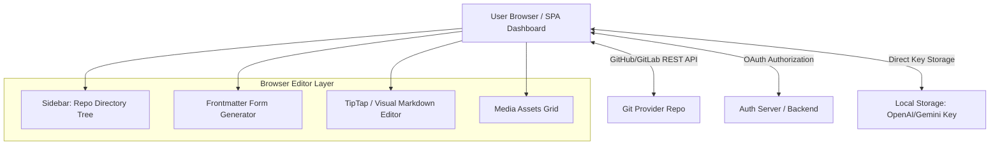

# Sitepins Clone Blueprint: Architectural Guide & Implementation Plan

This document provides a comprehensive analysis of **Sitepins**, how it works, and how we can build a pixel-perfect, feature-rich clone. 

Sitepins is a **Git-driven, database-less content management system (CMS)**. It does not render or build the site; instead, it overlays a visual/WYSIWYG editing layer directly on top of files (Markdown, JSON, TOML, YAML) hosted in a GitHub/GitLab repository.

---

## 1. Core Paradigm: "Git-as-a-Database"
The defining feature of Sitepins is that it is entirely **stateless** from a database perspective for content. Instead of storing schemas, configuration, snippets, and content on a central server database, it stores everything inside the target user's repository under a hidden configuration directory: `.sitepins/`.

### Configuration Structure (.sitepins/)
When a user connects their website, our clone will read/write the following structures directly in their repository:
*   `.sitepins/config.json`: Stores folder settings, paths, custom sidebar mappings, and commit preferences.
*   `.sitepins/schema/[schema-name].json`: Stores JSON Schema-like configurations detailing frontmatter field UI representations (e.g., text, rich text, selects, booleans, dates) for specific folder templates.
*   `.sitepins/snippet/[snippet-name].json`: Stores content snippets (e.g., Hugo shortcodes, JSX blocks, HTML components) available for quick insert.

---

## 2. Analyzed Architecture: How Sitepins Works

### Key Technical Pillars
1.  **Auth & Provider Sync**: Users authenticate via GitHub/GitLab OAuth. The app requests repository access scoped to read/write contents.
2.  **Schema Auto-Detection**: When creating a schema, the app parses an existing frontmatter block (YAML or TOML), detects the data types, and saves a JSON description map to `.sitepins/schema/`.
3.  **WYSIWYG Markdown Rendering**: Rich visual editing uses a WYSIWYG editor (e.g., TipTap) that translates Markdown to clean HTML on load, and compiles visual changes back into clean Markdown + frontmatter on save.
4.  **Sidebar Customization**: Editors can rearrange the layout visually without altering file folders. This custom mapping is saved inside `.sitepins/config.json`.
5.  **Media Mapping**: The Media Library maps physical repository folders (like `public/images`) to public paths (like `/images`) so assets render correctly in the visual preview.

---

## 3. Our Clone Architecture

We will build the clone using a modern, fast, and visual-first stack. Since this is a client-heavy application with lots of rich-text operations and Git syncing, we will prioritize a premium React/Next.js SPA.

### Tech Stack Selection
*   **Core Framework**: Next.js (App Router) for hybrid rendering and API route handling of OAuth tokens securely.
*   **Styling**: Vanilla CSS with HSL-based color tokens, dark mode/light mode themes, and smooth micro-animations.
*   **WYSIWYG Editor**: **TipTap** (built on ProseMirror) with custom extensions to parse frontmatter blocks and custom snippets.
*   **Git API Client**: `Octokit` (for GitHub) and `@gitbeaker/rest` (for GitLab).
*   **Frontmatter Parsing**: `gray-matter` for Markdown parsing, `js-yaml` for YAML configuration, and `@iarna/toml` for TOML configuration.
*   **AI Integration**: Standardized client-side completions using the official Vercel AI SDK or direct fetch calls to AI provider endpoints using keys stored securely in browser `localStorage`.

---

## 4. Feature Matrix: Sitepins vs. Our Clone

| Feature | Sitepins Implementation | Our Clone Strategy |
| :--- | :--- | :--- |
| **Repo Connection** | GitHub/GitLab OAuth + Repository Tree API | Next.js API handles OAuth callback, stores token in HTTP-only session cookie. Octokit retrieves tree. |
| **Visual Editor** | visual + MD toggles, inline toolbar | TipTap with Markdown parser and custom parser for frontmatter fields. |
| **Media Library** | Drag & Drop, folders, preview, delete | Direct GitHub API folder write. Renders raw/canonical GitHub URLs for preview. |
| **Schemas** | YAML/TOML extraction, fields builder | Schema manager UI generates JSON forms dynamically using standard HTML inputs. |
| **Snippets** | Hover over code block, click "+", save | Parse special brackets (e.g. `{}`) as custom inline blocks in the editor. |
| **Arrangement** | Drag-and-drop visual tree modifier | React Drag and Drop library representing virtual routes mapped in config. |
| **AI Integration** | local AI settings (API keys saved in browser) | Dynamic serverless gateway using custom user-supplied keys passed in headers. |

---

## 5. Detailed Implementation Plan

### Phase 1: Authentication & Repository Access
*   Configure GitHub OAuth Application.
*   Create authorization flow inside `src/app/api/auth/`.
*   Build the repository explorer screen showing list of repos, branches, and a framework selector (Astro, Next.js, Hugo).

### Phase 2: Configuration & Directory mapping
*   Establish directory explorer UI.
*   Read `.sitepins/config.json` if it exists. If not, auto-suggest folders:
    *   **Astro / Next.js**: Content = `src/content`, Media Root = `public/images`, Media Public = `public`
    *   **Hugo**: Content = `content`, Media Root = `static/images`, Media Public = `static`
*   Allow saving configurations which commits a fresh `.sitepins/config.json` via GitHub API.

### Phase 3: Content Editing & Markdown/WYSIWYG Compiler
*   Build Frontmatter parser & editor form. Read YAML (`---` delimiters) or TOML (`+++` delimiters).
*   Create visual field inputs based on detected frontmatter types (Text, Boolean, Date picker, nested Objects).
*   Implement TipTap visual editor sync. On edit, convert Markdown body to HTML. On save, serialize visual body back to Markdown.
*   Implement custom commit dialog popup if custom commit messages are enabled.

### Phase 4: Schema & Snippet Engine
*   Build **Schema Auto-Generator**: reads any chosen Markdown file, extracts the keys from YAML frontmatter, detects type (Boolean if true/false, Date if matches ISO, Array if is list), and writes to `.sitepins/schema/[name].json`.
*   Build **Snippet Manager**: detects snippets, registers them into TipTap block templates, and saves snippet JSON files to `.sitepins/snippet/`.

### Phase 5: Media Library
*   List media assets by querying GitHub Repo tree API inside Media Root.
*   Allow dragging & dropping files, translating them to base64, and publishing them directly to Git using content creation API.
*   Build folders mapping (virtual paths translating to real Git subdirectories).

### Phase 6: AI Co-pilot
*   Integrate OpenAI, Google Gemini, Anthropic Claude, and xAI Grok.
*   Create key settings tab that saves user api keys directly to browser `localStorage` (ensures zero database credential exposure).
*   Add inline selection menu in TipTap: "Improve Writing", "Change Tone", "Fix Grammar", "Autocomplete".

---

## 6. Premium User Interface Design

To wow the user, the layout will adopt a sleek dark mode dashboard inspired by Linear and Vercel. 

### Style Tokens:
*   **Background**: Deep absolute black (`#09090b`) with obsidian card borders (`#27272a`).
*   **Highlights**: HSL indigo/violet gradients (`hsl(263.4, 70%, 50.4%)`).
*   **Typography**: Google Font "Inter" for UI controls, "JetBrains Mono" for code blocks, and "Outfit" for headings.
*   **Animations**: Spring transition curves for sidebar dropdowns and drag-and-drop overlays.
*   **Glassmorphism**: Backdrop blur headers (`backdrop-filter: blur(12px)`) with thin semi-transparent white borders.
